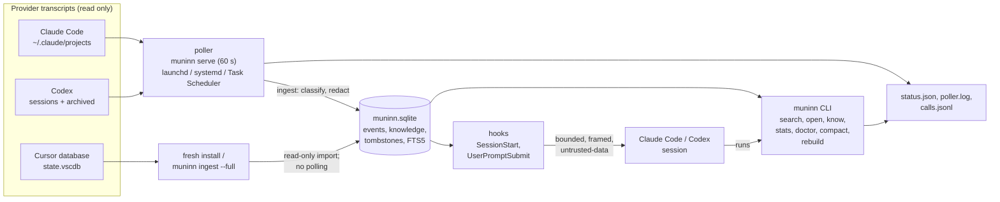

# Architecture

- **One writer at a time.** The poller, `ingest`, `erase`, `compact`, `rebuild` and
  `know add` take an exclusive lock on `writer.lock`: `fcntl.flock` on macOS and Linux,
  `msvcrt.locking` on Windows. Readers open the database read-only. The journal mode is
  DELETE, so a crash leaves a journal that the next writer rolls back.
- **Native poller.** macOS uses launchd, Linux a systemd user service, and Windows Task
  Scheduler. Each runs `muninn serve --interval 60`.
- **Pinned release.** Services and provider hooks run the installed launcher. On macOS
  and Linux, `~/.local/lib/muninn/current/bin/muninn` selects the interpreter from
  `$MUNINN_PYTHON`, then the installer's `python` link, then Python 3.13+ on PATH. On
  Windows, the stable `bin/muninn.cmd` and `bin/muninn.ps1` launchers use
  `lib/selection.json` to select the pinned release; interpreter selection tries
  `MUNINN_PYTHON`, the recorded interpreter, then Python 3.13+ on PATH, with native path
  and ACL checks.
- **Installer.** `install/installer.py` has two modes (`--fresh`, `--upgrade`) over one
  step pipeline. A fresh install runs pin, first ingest, start, Claude and Codex config,
  verify, prune. An upgrade runs `snapshot_store` (copies the store when the new release
  will migrate its schema, `install/snapshot.py`), pin, restart, verify, prune, and
  deletes the copy after the prune. `install/rollback.py` reverses it from the recorded
  values, restoring that copy over a migrated store. `install/uninstall.py` removes
  Muninn installation entries (no record survives an upgrade) and moves the data dir
  aside instead of deleting it (unless `--purge-data`).
- **Trust.** Stored content is untrusted historical data. Secrets receive best-effort
  redaction at ingest and on output; automatic injection is framed so pasted copies are
  flagged on ingest. See the README for the full list.

## Platform CI

`.github/workflows/platforms.yml` uses standard GitHub-hosted runners. Windows x64
(`windows-2022`) and ARM64 (`windows-11-arm`) each run two jobs in parallel:

- **Proof:** real Windows lifecycle, then the pinned Codex binary and rendered provider
  routes, with native proof diagnostics uploaded as artifacts.
- **Gate:** Windows native API typing and the mandatory `tools.check --full` gate.

Both Windows architectures run the full set of required checks. macOS and Linux run
their checks in one job each. Python setup caches pip downloads using
`requirements-dev.txt`; each job still installs and verifies its tools.

Lifecycle diagnostics include bounded integer phase durations in milliseconds, retained
across phase transitions and failures. These durations are inclusive; nested timings
must not be added together. Diagnostic artifacts retain codes and numeric measurements,
not transcript content, for one day.

The **75-minute limit is a per-job failure ceiling**, not an expected run duration. The
Windows lifecycle child has a separate **1,800-second ceiling**. CI overlaps the Windows
proof and gate jobs to reduce elapsed time while retaining both limits and the complete
check coverage.
