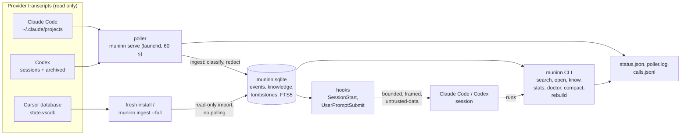

# Architecture

- **One writer at a time.** The poller, `ingest`, `erase`, `compact`,
  `rebuild` and `know add` take the flock on `writer.lock`; readers open the database
  read-only. The journal mode is DELETE, so a crash leaves a journal that the
  next writer rolls back.
- **Pinned release.** launchd and the hooks run
  `~/.local/lib/muninn/current/bin/muninn`; `bin/muninn` picks the
  interpreter from `$MUNINN_PYTHON`, then the installer's `python` link, then
  Python 3.13+ on PATH.
- **Installer.** `install/installer.py` has two modes (`--fresh`,
  `--upgrade`) over one step pipeline. A fresh install runs pin, first ingest, start,
  Claude and Codex config, verify, prune. An upgrade runs `snapshot_store` (copies the store when
  the new release will migrate its schema, `install/snapshot.py`), pin, restart, verify, prune,
  and deletes the copy after the prune. `install/rollback.py` reverses it from the recorded
  values, restoring that copy over a migrated store. `install/uninstall.py` takes an
  installed machine back out by removing our own entries (no record survives an
  upgrade) and moves the data dir aside instead of deleting it (unless
  `--purge-data`).
- **Trust.** Everything stored is untrusted historical data. Secrets get
  best-effort redaction at ingest and on output; automatic injection is framed so pasted
  copies are flagged on ingest. See the README for the full list.
