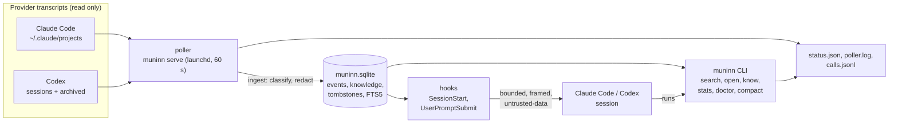

# Architecture

- **One writer at a time.** The poller, `ingest`, `erase`, `compact` and
  `know add` take the flock on `writer.lock`; readers open the database
  read-only. The journal mode is DELETE, so a crash leaves a journal that the
  next writer rolls back.
- **Pinned release.** launchd and the hooks run
  `~/.local/lib/muninn/current/bin/muninn`; `bin/muninn` picks the
  interpreter from `$MUNINN_PYTHON`, then the installer's `python` link, then
  Python 3.13+ on PATH.
- **Installer.** `install/installer.py` has two modes (`--fresh`,
  `--upgrade`) over one step pipeline: record, pin, build or restart, merge
  provider config, verify, prune. `install/rollback.py`
  reverses it from the recorded values.
- **Trust.** Everything stored is untrusted historical data. Secrets are
  redacted at ingest and on output; automatic injection is framed so pasted
  copies are flagged on ingest. See the README for the full list.
